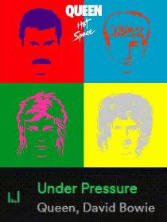

## Greetings! I'm Henrique Bidarte, Fullstack Software Developer. 

- 🔭 I’m currently working on Software Development
- 🧠 I’m currently learning AI
- ☄️ I'm a Developer at CWI - Software
- 📫 How to reach me: henriqueb1208@gmail.com
- 🎲 Fun fact: I'm a Tabletop Rpg Dungeon Master

##

### Casually listening to music while the snake eats my Contribution Graph 🐍 

 

<picture>
  <source
    media="(prefers-color-scheme: dark)"
    srcset="https://github.com/henrique-bidarte/henrique-bidarte/blob/output/github-contribution-grid-snake-dark.svg"
  />
  <source
    media="(prefers-color-scheme: light)"
    srcset="https://github.com/henrique-bidarte/henrique-bidarte/blob/output/github-contribution-grid-snake.svg"
  />
  
</picture>

  

## 

  <a href="https://github.com/henrique-bidarte">
  
<!--    -->

###

  
  

